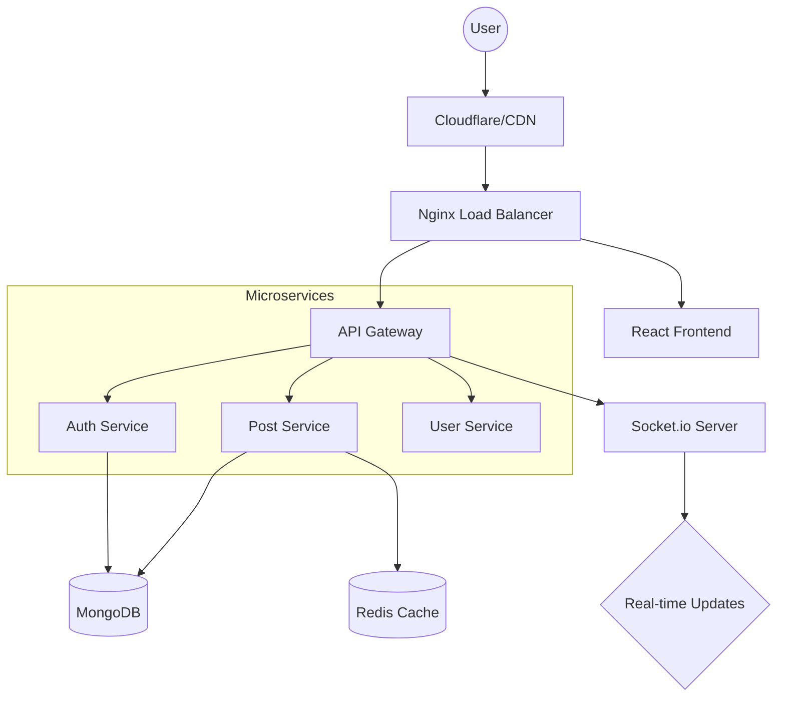

```markdown
# 🚀 Nexa Social Media Platform


<div align="center">

[](#)
[](https://github.com/yourusername/neza-social-media)
[](LICENSE)
[](#)
[](#)

**Nexa** is a high-performance, full-stack social ecosystem. Designed for real-time engagement, secure data handling, and seamless scalability.

[Explore Demo](https://neza-app.vercel.app) • [API Docs](https://api.neza.app/docs) • [Report Bug](https://github.com/yourusername/neza-social-media/issues)

</div>

---

## 📖 Table of Contents
- [✨ Key Features](#-key-features)
- [🏗️ System Architecture](#️-system-architecture)
- [💻 Tech Stack](#-tech-stack)
- [🚀 Quick Start](#-quick-start)
- [🐳 Docker Usage](#-docker-usage)
- [📦 Production Deployment](#-production-deployment)
- [🔒 Security Protocols](#-security-protocols)
- [🤝 Contributing](#-contributing)

---

## ✨ Key Features

### 🔐 Security & Auth
* **Modern Auth:** JWT with Refresh Token rotation & HttpOnly cookies.
* **RBAC:** Built-in Role-Based Access Control (User, Moderator, Admin).
* **Safety:** Rate limiting, bcrypt password hashing, and XSS/NoSQL injection protection.

### 📱 User Experience
* **Real-time:** Instant notifications and messaging via WebSockets.
* **Performance:** Infinite scroll pagination and optimized image delivery (WebP/Cloudinary).
* **Theming:** Native Dark/Light mode support with Tailwind CSS.
* **PWA:** Installable on mobile and desktop devices.

### 📊 Social Engine
* **Engagement:** Like, comment, share, and nested hashtag support.
* **Profiles:** Custom bios, media galleries, and follow/unfollow dynamics.
* **Discovery:** Trending algorithms based on engagement velocity.

---

## 🏗️ System Architecture



---

## 💻 Tech Stack

### Frontend

| Tool | Purpose |
| --- | --- |
| **React 18** | UI Logic |
| **Vite** | Bundling & HMR |
| **Tailwind CSS** | Styling |
| **Zustand** | Global State |
| **React Query** | Server State / Caching |

### Backend

| Tool | Purpose |
| --- | --- |
| **Node.js** | Runtime |
| **Express.js** | Web Framework |
| **MongoDB** | Primary Database |
| **Redis** | Caching & Rate Limiting |
| **Socket.io** | Real-time Communication |

---

## 🚀 Quick Start

### 1. Clone & Install

```bash
git clone [https://github.com/yourusername/neza-social-media.git](https://github.com/yourusername/neza-social-media.git)
cd nexa-social-media
npm run install-all # Custom script to install both FE/BE

```

### 2. Environment Setup

Create a `.env` file in the `/backend` directory:

```env
PORT=5000
MONGODB_URI=mongodb://localhost:27017/nexa
REDIS_URL=redis://localhost:6379
JWT_SECRET=your_super_secret_key
CLOUDINARY_URL=your_cloudinary_link

```

### 3. Run Development

```bash
# In separate terminals or using concurrently
# Backend
cd backend && npm run dev

# Frontend
cd frontend && npm run dev

```

---

## 🐳 Docker Usage

The easiest way to get Nexa running in a production-like environment:

```bash
# Build and launch all services (MongoDB, Redis, API, Frontend)
docker-compose up --build -d

```

---

## 🔒 Security Protocols

We take security seriously. Nexa implements:

* **Helmet.js:** Secure HTTP headers.
* **CORS:** Strict origin whitelisting.
* **Sanitization:** Express-mongo-sanitize to prevent NoSQL injection.
* **Winston:** Centralized encrypted logging for audit trails.

---

## 🧪 Testing

```bash
# Run Unit Tests
npm run test

# Run Coverage Report
npm run test:coverage

```

---

## 🤝 Contributing

1. Fork the Project
2. Create your Feature Branch (`git checkout -b feature/AmazingFeature`)
3. Commit your Changes (`git commit -m 'Add some AmazingFeature'`)
4. Push to the Branch (`git push origin feature/AmazingFeature`)
5. Open a Pull Request

---

## 📄 License

Distributed under the MIT License. See `LICENSE` for more information.

## 📞 Contact & Support

* **Phone Support:** +255 759 637 644

<div align="center">


[⬆ Back to Top](https://www.google.com/search?q=%23-nexa-social-media-platform)

</div>
